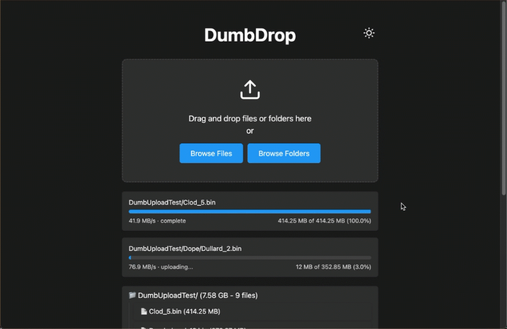

<!--
Ohart ongi: README hau automatikoki sortu da <https://github.com/YunoHost/apps/tree/master/tools/readme_generator>ri esker
EZ editatu eskuz.
-->

# DumbDrop YunoHost-erako

[](https://ci-apps.yunohost.org/ci/apps/dumbdrop/)


[](https://install-app.yunohost.org/?app=dumbdrop)

*[Irakurri README hau beste hizkuntzatan.](./ALL_README.md)*

> *Pakete honek DumbDrop YunoHost zerbitzari batean azkar eta zailtasunik gabe instalatzea ahalbidetzen dizu.*  
> *YunoHost ez baduzu, kontsultatu [gida](https://yunohost.org/install) nola instalatu ikasteko.*

## Aurreikuspena

A stupid simple file upload application that provides a clean, modern interface for dragging and dropping files. Built with Node.js and vanilla JavaScript.

### Features

    🚀 Drag and drop file uploads
    📁 Multiple file selection
    🎨 Clean, responsive UI with Dark Mode
    📦 Docker support with easy configuration
    📂 Directory upload support (maintains structure)
    🔒 Optional PIN protection
    📱 Mobile-friendly interface
    🔔 Configurable notifications via Apprise
    ⚡ Zero dependencies on client-side
    🛡️ Built-in security features
    💾 Configurable file size limits
    🎯 File extension filtering


**Paketatutako bertsioa:** 1.0.0~ynh1

## Pantaila-argazkiak



## Dokumentazioa eta baliabideak

- Aplikazioaren webgune ofiziala: <https://www.dumbware.io/>
- Jatorrizko aplikazioaren kode-gordailua: <https://github.com/DumbWareio/DumbDrop>
- YunoHost Denda: <https://apps.yunohost.org/app/dumbdrop>
- Eman errore baten berri: <https://github.com/YunoHost-Apps/dumbdrop_ynh/issues>

## Garatzaileentzako informazioa

Bidali `pull request`a [`testing` abarrera](https://github.com/YunoHost-Apps/dumbdrop_ynh/tree/testing).

`testing` abarra probatzeko, ondorengoa egin:

```bash
sudo yunohost app install https://github.com/YunoHost-Apps/dumbdrop_ynh/tree/testing --debug
edo
sudo yunohost app upgrade dumbdrop -u https://github.com/YunoHost-Apps/dumbdrop_ynh/tree/testing --debug
```

**Informazio gehiago aplikazioaren paketatzeari buruz:** <https://yunohost.org/packaging_apps>
