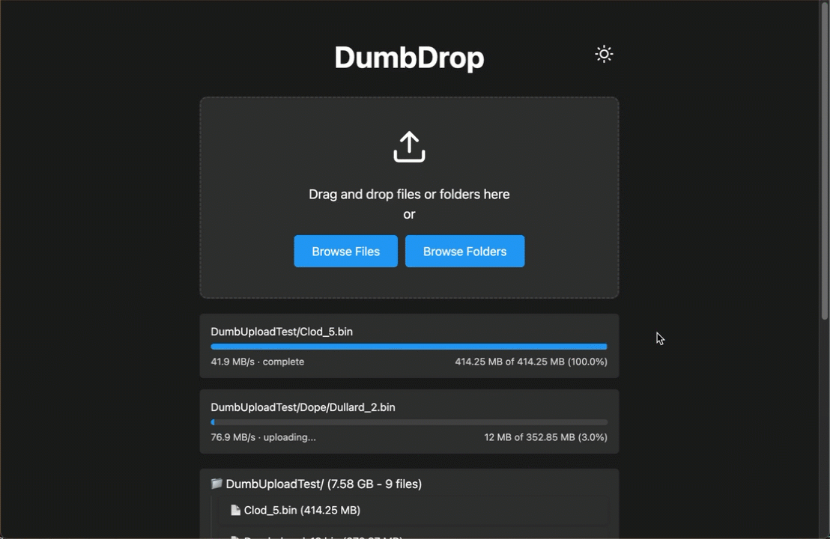

<!--
To README zostało automatycznie wygenerowane przez <https://github.com/YunoHost/apps/tree/master/tools/readme_generator>
Nie powinno być ono edytowane ręcznie.
-->

# DumbDrop dla YunoHost

[](https://ci-apps.yunohost.org/ci/apps/dumbdrop/)


[](https://install-app.yunohost.org/?app=dumbdrop)

*[Przeczytaj plik README w innym języku.](./ALL_README.md)*

> *Ta aplikacja pozwala na szybką i prostą instalację DumbDrop na serwerze YunoHost.*  
> *Jeżeli nie masz YunoHost zapoznaj się z [poradnikiem](https://yunohost.org/install) instalacji.*

## Przegląd

A stupid simple file upload application that provides a clean, modern interface for dragging and dropping files. Built with Node.js and vanilla JavaScript.

### Features

- Drag and drop file uploads
- Multiple file selection
- Clean, responsive UI with Dark Mode
- Docker support with easy configuration
- Directory upload support (maintains structure)
- Optional PIN protection
- Mobile-friendly interface
- Configurable notifications via Apprise
- Zero dependencies on client-side
- Built-in security features
- Configurable file size limits
- File extension filtering


**Dostarczona wersja:** 2025.02.27~ynh1

## Zrzuty ekranu



## Dokumentacja i zasoby

- Oficjalna strona aplikacji: <https://www.dumbware.io/>
- Repozytorium z kodem źródłowym: <https://github.com/DumbWareio/DumbDrop>
- Sklep YunoHost: <https://apps.yunohost.org/app/dumbdrop>
- Zgłaszanie błędów: <https://github.com/YunoHost-Apps/dumbdrop_ynh/issues>

## Informacje od twórców

Wyślij swój pull request do [gałęzi `testing`](https://github.com/YunoHost-Apps/dumbdrop_ynh/tree/testing).

Aby wypróbować gałąź `testing` postępuj zgodnie z instrukcjami:

```bash
sudo yunohost app install https://github.com/YunoHost-Apps/dumbdrop_ynh/tree/testing --debug
lub
sudo yunohost app upgrade dumbdrop -u https://github.com/YunoHost-Apps/dumbdrop_ynh/tree/testing --debug
```

**Więcej informacji o tworzeniu paczek aplikacji:** <https://yunohost.org/packaging_apps>
